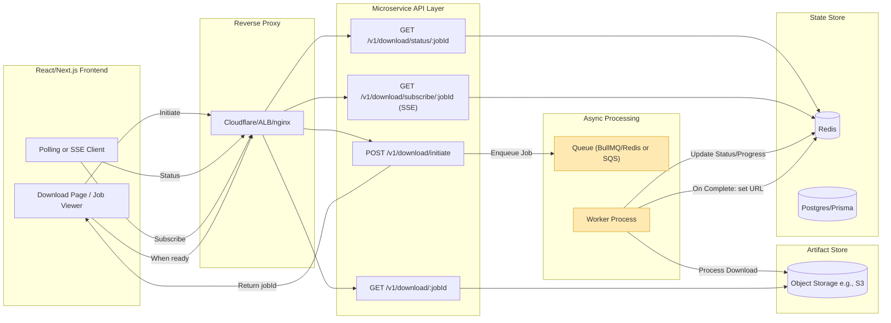

# Download Microservice Integration Architecture

This document proposes a robust, proxy-friendly design for integrating the download microservice with a fullstack application, handling variable processing times (10–120+ seconds) gracefully.

## Architecture Diagram



- Fast path (≤ ~10s): Job completes quickly; client receives ready state during initial polls/SSE and immediately downloads.
- Slow path (≥ ~100s): Job runs asynchronously in worker; client sees progress via polling/SSE; when complete, client downloads via a short-lived presigned URL.

## Technical Approach

### Chosen Pattern: Hybrid (Polling + SSE + Presigned URLs)

- Use a job-based async processing model with a queue (BullMQ on Redis) to decouple request-response from long-running work.
- Client initiates and immediately receives `jobId`.
- Client monitors job status via either:
  - Polling: Reliable behind all proxies; simplest to implement.
  - Server-Sent Events (SSE): Real-time, proxy-friendly (HTTP/1.1 stream) without the complexity of WebSockets. Prefer SSE over WebSockets due to broader proxy compatibility and simpler implementation.
- On completion, server stores/returns a presigned download URL to the artifact in object storage (e.g., S3) to avoid streaming large files via the API and proxy.

Rationale:

- Polling works everywhere and avoids long-held HTTP connections.
- SSE offers better UX for progress without tight polling intervals and is simpler than WebSockets.
- Presigned URLs offload large data transfer to object storage/CDN, reducing server load and avoiding proxy timeouts.

### API Contract Changes

Current endpoint (example):

- `POST /v1/download/start` synchronously triggers work and holds the connection — susceptible to timeouts.

Proposed changes:

- Deprecate/repurpose `POST /v1/download/start` to enqueue and return `202 Accepted` with `jobId`.
- Introduce explicit job endpoints for status and artifact retrieval.

### New/Updated Endpoints

1. `POST /v1/download/initiate`
   - Request: `{ file_id: number, options?: {...}, userId?: string }`
   - Response (202): `{ jobId: string, status: "queued" }`
   - Behavior: Validates input, creates job record in Redis/DB, enqueues job in BullMQ.

2. `GET /v1/download/status/:jobId`
   - Response (200): `{ jobId, status, progress, etaSeconds, error?: {code,message}, result?: { url, expiresAt } }`
   - Status: `queued | running | completed | failed | canceled`
   - Progress: `0-100` (optional), and `etaSeconds` if estimable.

3. `GET /v1/download/subscribe/:jobId` (SSE)
   - Response: `text/event-stream` sending events: `status`, `progress`, `error`, `result`.
   - Auto-reconnect: Client uses SSE with retry backoff.

4. `GET /v1/download/:jobId`
   - Response (302 or 200): Redirects to `result.url` if present and valid; or returns JSON with the URL.
   - Behavior: Validates job completion and the presigned URL is fresh, otherwise generates a new one.

5. `POST /v1/download/cancel/:jobId` (optional)
   - Allows client to cancel a long-running job.

6. `POST /v1/download/retry/:jobId` (optional guarded)
   - Re-enqueues failed jobs with limits.

Note: Use idempotency keys (`Idempotency-Key` header) to prevent duplicate jobs from client retries.

### Job Status Schema (Redis/DB)

Use Redis as primary status store for speed with optional Postgres for audit/history.

- Key: `download:job:{jobId}`
- Fields:
  - `status`: string (`queued|running|completed|failed|canceled`)
  - `progress`: number (0-100)
  - `etaSeconds`: number
  - `errorCode`: string | null
  - `errorMessage`: string | null
  - `fileId`: number
  - `userId`: string | null
  - `artifactKey`: string | null (location in object store)
  - `presignedUrl`: string | null
  - `expiresAt`: number | null (epoch seconds)
  - `createdAt`: number
  - `updatedAt`: number
  - `attempts`: number

Retention policy: expire completed/failed jobs after N hours/days, persist minimal audit in SQL if needed.

### Background Job Processing

- Queue: BullMQ with Redis (or AWS SQS + worker if cloud-native).
- Worker processes jobs independently of API, updating Redis fields for status and progress.
- On completion, worker writes artifact to object storage and generates a presigned URL valid for a short duration (e.g., 15 minutes).
- For small artifacts (< few MB), server could stream directly, but presigned URLs are generally preferred.

Concurrency:

- Configure worker concurrency based on CPU/IO limits.
- Use rate limiting to prevent resource exhaustion.

### Error Handling and Retry Logic

- Client-side retries:
  - Initiation: Include `Idempotency-Key` to deduplicate.
  - Status polling: Exponential backoff (e.g., 1s → 2s → 5s → 10s, cap at 15s), stop after completion/terminal failure.
  - SSE: Auto-reconnect with backoff.
- Server-side retries:
  - Use BullMQ `attempts` and `backoff` policies; cap attempts (e.g., 3) and record last error.
- Cancellation:
  - Allow cancel to avoid wasted work if the user navigates away.
- Timeouts:
  - API: keep endpoints short-lived; no long-held requests.
  - Worker: per-job timeout (e.g., 10–300s) based on `fileId` size/class.
  - Presigned URLs: short lifetime; refresh on access if expired.

### Timeout Configuration at Each Layer

- Client: request timeout ~30s for API calls; SSE connections can be long-lived but should auto-reconnect.
- Proxy (Cloudflare/nginx/ALB): Avoid long-held HTTP requests by using the hybrid approach. For SSE, configure appropriate timeouts and buffering.
- API server: Short request handlers; do not block waiting for job completion.
- Worker: Enforce job max runtime; fail and mark as error if exceeded.
- Object Storage: Presigned URLs with expiry (e.g., 900s).

## Proxy Configuration Examples

### Cloudflare

- Issue: 100s max for HTTP requests; WebSockets are supported but may still face disconnects; SSE over HTTP streaming generally works if origin keeps connection alive.
- Recommendations:
  - Prefer polling or SSE; avoid holding POSTs open.
  - Enable WebSocket/SSE support if using those features.
  - Use CDN caching for artifacts via presigned URLs.

No explicit config snippet for Cloudflare (managed), but ensure:

- Set `Cache-Control` headers on artifact responses.
- Use `event-stream` content type for SSE.

### nginx (reverse proxy in front of API)

Example for SSE + short API timeouts:

```nginx
server {
    listen 80;

    location /v1/download/subscribe/ {
        proxy_http_version 1.1;
        proxy_set_header Connection "";
        proxy_set_header Cache-Control "no-cache";
        proxy_buffering off;           # important for SSE
        proxy_read_timeout 300s;       # allow long-lived SSE
        proxy_send_timeout 300s;
        proxy_pass http://api:3000;
    }

    location /v1/download/ {
        proxy_read_timeout 30s;        # short-lived API calls
        proxy_send_timeout 30s;
        proxy_connect_timeout 10s;
        proxy_pass http://api:3000;
    }
}
```

### AWS ALB

- Configure idle timeout to accommodate SSE (e.g., 300s) on target group if using streaming.
- Ensure health checks and timeouts are compatible with short API calls.

## Frontend Integration (React/Next.js)

### Initiation Flow

- User clicks “Start Download”.
- Call `POST /v1/download/initiate` with `file_id` and optional `Idempotency-Key`.
- Receive `{ jobId }` and navigate to Job Viewer.

### Progress Updates

- Option A: Polling
  - Poll `GET /v1/download/status/:jobId` with exponential backoff.
  - Update progress bar, show `status`, `etaSeconds`.
- Option B: SSE
  - Connect to `GET /v1/download/subscribe/:jobId` using `EventSource`.
  - Handle messages: `status`, `progress`, `error`, `result`.

### Completion & Download

- When `status === 'completed'`, either:
  - Call `GET /v1/download/:jobId` to get/refresh `result.url`, then `window.location.href = url`, or create an `<a href>` download.
- Show remaining validity time for presigned URL.

### Failure & Retry

- Show error message and allow `Retry` (calls `POST /v1/download/retry/:jobId` if available) or re-initiate.
- Use idempotency key to prevent duplicates.

### Handling Browser Close/Navigation Away

- Jobs continue server-side.
- If the user returns, restore UI state by querying `status`.
- Provide `Cancel` if desired to save resources.

### Multiple Concurrent Downloads

- Maintain a per-user job list in the UI (local state + server `GET /v1/download/jobs?userId=...` optional).
- Limit concurrent active jobs per user with server-side quotas.

### Example Frontend Snippets

Polling (React):

```ts
async function startDownload(fileId: number) {
  const res = await fetch("/v1/download/initiate", {
    method: "POST",
    headers: {
      "Content-Type": "application/json",
      "Idempotency-Key": crypto.randomUUID(),
    },
    body: JSON.stringify({ file_id: fileId }),
  });
  const { jobId } = await res.json();
  return jobId;
}

async function getStatus(jobId: string) {
  const res = await fetch(`/v1/download/status/${jobId}`);
  return res.json();
}

// Exponential backoff polling
async function pollStatus(jobId: string, onUpdate: (s: any) => void) {
  let delay = 1000;
  const max = 15000;
  while (true) {
    const s = await getStatus(jobId);
    onUpdate(s);
    if (
      s.status === "completed" ||
      s.status === "failed" ||
      s.status === "canceled"
    )
      break;
    await new Promise((r) => setTimeout(r, delay));
    delay = Math.min(max, Math.round(delay * 1.7));
  }
}
```

SSE (React):

```ts
function subscribe(jobId: string, onUpdate: (s: any) => void) {
  const es = new EventSource(`/v1/download/subscribe/${jobId}`);
  es.onmessage = (ev) => {
    try {
      onUpdate(JSON.parse(ev.data));
    } catch {}
  };
  es.onerror = () => {
    // Let the browser auto-reconnect; optionally close & reopen
  };
  return () => es.close();
}
```

Download when ready:

```ts
async function fetchDownloadUrl(jobId: string) {
  const res = await fetch(`/v1/download/${jobId}`);
  const data = await res.json();
  return data.url;
}

async function startFileDownload(jobId: string) {
  const url = await fetchDownloadUrl(jobId);
  window.location.href = url;
}
```

## Notes on Costs and Trade-offs

- Redis + BullMQ: Low operational overhead; ideal for self-hosted.
- SQS + Lambda/ECS workers: Pay-per-use; scales well; slightly higher complexity.
- SSE over WebSockets: SSE avoids extra infra and most proxy complexities; WebSockets can be used if you need bi-directional communication.
- Presigned S3 URLs: Minimal egress from API servers; can integrate with Cloudflare/AWS CloudFront for CDN caching.

## Summary

This hybrid approach avoids long-held HTTP connections, provides real-time or near-real-time progress to users, and scales reliably behind common reverse proxies. It improves UX, reduces resource exhaustion, and eliminates retry storms via idempotency and decoupled processing.
